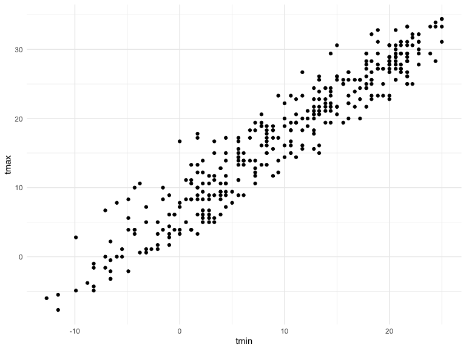
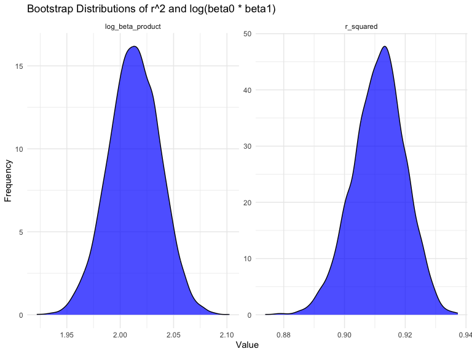
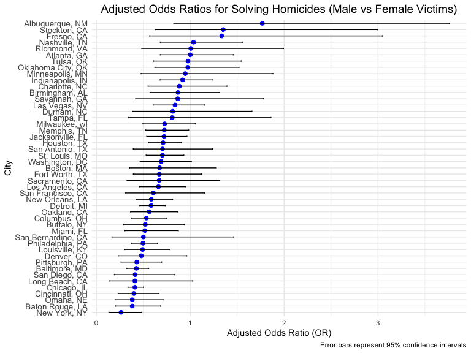
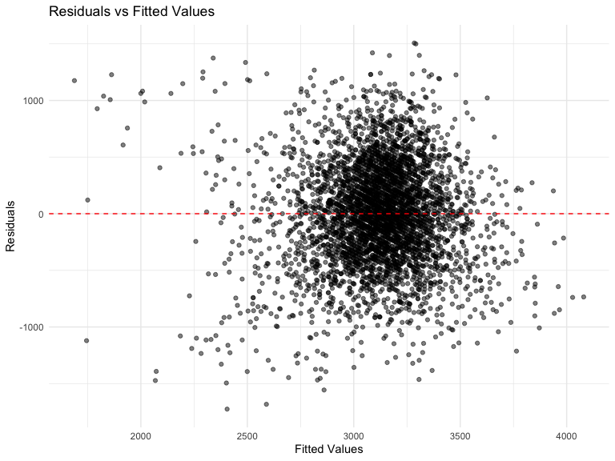
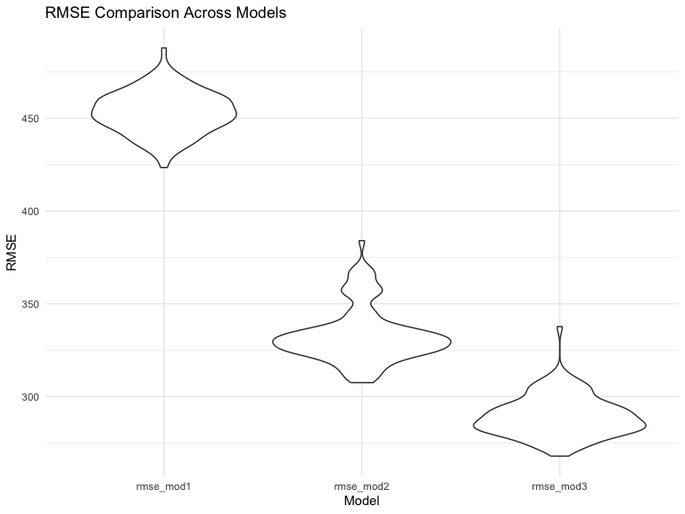

p8105_hw6_rd3096
================
Timothy Du

# load necessary pakages

``` r
library(tidyverse)
```

    ## ── Attaching core tidyverse packages ──────────────────────── tidyverse 2.0.0 ──
    ## ✔ dplyr     1.1.4     ✔ readr     2.1.5
    ## ✔ forcats   1.0.0     ✔ stringr   1.5.1
    ## ✔ ggplot2   3.5.1     ✔ tibble    3.2.1
    ## ✔ lubridate 1.9.3     ✔ tidyr     1.3.1
    ## ✔ purrr     1.0.2     
    ## ── Conflicts ────────────────────────────────────────── tidyverse_conflicts() ──
    ## ✖ dplyr::filter() masks stats::filter()
    ## ✖ dplyr::lag()    masks stats::lag()
    ## ℹ Use the conflicted package (<http://conflicted.r-lib.org/>) to force all conflicts to become errors

``` r
library(rnoaa)
```

    ## The rnoaa package will soon be retired and archived because the underlying APIs have changed dramatically. The package currently works but does not pull the most recent data in all cases. A noaaWeather package is planned as a replacement but the functions will not be interchangeable.

``` r
library(ggplot2)
library(modelr)
library(mgcv)
```

    ## Loading required package: nlme
    ## 
    ## Attaching package: 'nlme'
    ## 
    ## The following object is masked from 'package:dplyr':
    ## 
    ##     collapse
    ## 
    ## This is mgcv 1.9-1. For overview type 'help("mgcv-package")'.

``` r
library(broom)
```

    ## 
    ## Attaching package: 'broom'
    ## 
    ## The following object is masked from 'package:modelr':
    ## 
    ##     bootstrap

``` r
library(purrr)


set.seed(1)


knitr::opts_chunk$set(
    echo = TRUE,
    warning = FALSE,
    fig.width = 8, 
  fig.height = 6,
  out.width = "90%"
)

theme_set(theme_minimal() + theme(legend.position = "bottom"))

options(
  ggplot2.continuous.colour = "viridis",
  ggplot2.continuous.fill = "viridis"
)

scale_colour_discrete = scale_colour_viridis_d
scale_fill_discrete = scale_fill_viridis_d
```

## problem 1

we need to download the dataset using the code chunk below

``` r
weather_df = 
  rnoaa::meteo_pull_monitors(
    c("USW00094728"),
    var = c("PRCP", "TMIN", "TMAX"), 
    date_min = "2017-01-01",
    date_max = "2017-12-31") %>%
  mutate(
    name = recode(id, USW00094728 = "CentralPark_NY"),
    tmin = tmin / 10,
    tmax = tmax / 10) %>%
  select(name, id, everything())
```

    ## using cached file: /Users/timothysmacbook/Library/Caches/org.R-project.R/R/rnoaa/noaa_ghcnd/USW00094728.dly

    ## date created (size, mb): 2024-11-30 22:30:37.797162 (8.667)

    ## file min/max dates: 1869-01-01 / 2024-11-30

``` r
str(weather_df)
```

    ## tibble [365 × 6] (S3: tbl_df/tbl/data.frame)
    ##  $ name: chr [1:365] "CentralPark_NY" "CentralPark_NY" "CentralPark_NY" "CentralPark_NY" ...
    ##  $ id  : chr [1:365] "USW00094728" "USW00094728" "USW00094728" "USW00094728" ...
    ##  $ date: Date[1:365], format: "2017-01-01" "2017-01-02" ...
    ##  $ prcp: num [1:365] 0 53 147 0 0 13 81 0 0 0 ...
    ##  $ tmax: num [1:365] 8.9 5 6.1 11.1 1.1 0.6 -3.2 -3.8 -4.9 7.8 ...
    ##  $ tmin: num [1:365] 4.4 2.8 3.9 1.1 -2.7 -3.8 -6.6 -8.8 -9.9 -6 ...

``` r
weather_df %>% 
  ggplot(aes(x = tmin, y = tmax)) + 
  geom_point() 
```



Next, we will perform bootstrap sampling and regression analysis.

First, we need to write a function to create the two quantities that we
are interested.

``` r
compute_metrics = function(weather_sample) {
  model = lm(tmax ~ tmin, data = weather_sample)
  r_squared = glance(model)$r.squared
  coefficients = tidy(model)
  intercept = coefficients %>% 
    filter(term == "(Intercept)") %>% 
    pull(estimate)
  
  slope = coefficients %>%
    filter(term == "tmin") %>% 
    pull(estimate)
  
  log_beta_product = log(intercept * slope)
  
  tibble(
    r_squared = r_squared,
    log_beta_product = log_beta_product
  )
}
```

we will perform bootstramp using the map function

``` r
bootstrap_results = 
  weather_df %>%
  modelr::bootstrap (n = 5000) %>% 
  mutate(
    strap = map(strap, as_tibble),
    results = map(strap, compute_metrics)
    ) %>%
  unnest(results)
```

Final step, we will summarize the results and visualize using ggplot

``` r
bootstrap_summary =
  bootstrap_results %>%
  summarise(
    mean_r_squared = mean(r_squared),
    sd_r_squared = sd(r_squared),
    mean_log_beta_product = mean(log_beta_product),
    sd_log_beta_product = sd(log_beta_product)
  )


bootstrap_results %>%
  pivot_longer(
    cols = c(r_squared, log_beta_product), 
    names_to = "metric", 
    values_to = "value"
    ) %>%
  ggplot(aes(x = value)) +
  geom_density(fill = "blue", alpha = 0.7) +
  facet_wrap(. ~ metric, scales = "free") +
  theme_minimal() +
  labs(
    title = "Bootstrap Distributions of r^2 and log(beta0 * beta1)",
    x = "Value",
    y = "Frequency"
  )
```

 1.
Distribution of log(beta_0\*beta_1)

- The plot on the left represents the bootstrap distribution of this
  log_product, where beta_0 is the intercept and beta_1 is the slope.

- Shape: The distribution is approximately symmetric and bell-shaped,
  indicating that the log-transformed product of the intercept and slope
  is fairly stable across the bootstrap samples.

- Range: The values are centered around 2.0, with a slight spread from
  approximately 1.95 to 2.10.

- Interpretation: The logarithm of the product of the intercept and
  slope is consistent and suggests a central tendency (average value)
  close to 2.0.

2.  Distribution of r_square

- The plot on the right represents the bootstrap distribution of
  r_square, the proportion of variance in tmax explained by tmin.

- Shape: This distribution is also symmetric and bell-shaped, showing
  that the r_square values are consistently estimated across bootstrap
  samples.

- Range: The values are tightly centered around 0.91, with a slight
  spread from approximately 0.88 to 0.94.

- Interpretation: The r_square values indicate a strong linear
  relationship between tmin and tmax, with most bootstrap samples
  confirming a high proportion of variance explained.

we will construct the 95% CI

``` r
bootstrap_conf_intervals =
  bootstrap_results %>%
  summarise(
    r_squared_lower = quantile(r_squared, 0.025),
    r_squared_upper = quantile(r_squared, 0.975),
    log_beta_product_lower = quantile(log_beta_product, 0.025),
    log_beta_product_upper = quantile(log_beta_product, 0.975)
  )
bootstrap_conf_intervals
```

    ## # A tibble: 1 × 4
    ##   r_squared_lower r_squared_upper log_beta_product_lower log_beta_product_upper
    ##             <dbl>           <dbl>                  <dbl>                  <dbl>
    ## 1           0.894           0.927                   1.96                   2.06

Based on the output, we know that the 95% confidence interval for r^2 is
between 0.894 and 0.927, the 95% confidence interval for
log_beta_product is between 1.97 and 2.06.

## problem 2

first, we will read and clean the dataset

``` r
homicide_data = read_csv("https://raw.githubusercontent.com/washingtonpost/data-homicides/refs/heads/master/homicide-data.csv", na = c("NA","","."))
```

    ## Rows: 52179 Columns: 12
    ## ── Column specification ────────────────────────────────────────────────────────
    ## Delimiter: ","
    ## chr (9): uid, victim_last, victim_first, victim_race, victim_age, victim_sex...
    ## dbl (3): reported_date, lat, lon
    ## 
    ## ℹ Use `spec()` to retrieve the full column specification for this data.
    ## ℹ Specify the column types or set `show_col_types = FALSE` to quiet this message.

``` r
homicide_clean = 
  homicide_data %>%
  mutate(
    city_state = str_c(city, state, sep = ", "),
         solved = if_else(disposition == "Closed by arrest", 1, 0)) %>% 
  select(city_state,everything()) %>% 
  filter(!city_state %in% c("Dallas, TX", "Phoenix, AZ", "Kansas City, MO", "Tulsa, AL")) %>%
  filter(victim_race %in% c("White", "Black")) %>%
  mutate(victim_age = as.numeric(victim_age)) %>% 
  drop_na(victim_age)
```

we will run the glm function for city of Baltimore and tidy the result

``` r
baltimore_data =
  homicide_clean %>%
  filter(city_state == "Baltimore, MD") %>% 
  select(solved, victim_age, victim_race, victim_sex)


baltimore_glm =
  glm(
  solved ~ victim_age + victim_sex + victim_race, 
  data = baltimore_data, 
  family = binomial
) 
save(baltimore_glm, file = "./results/baltimore_glm.RData")


baltimore_tidy =
  baltimore_glm %>% 
  broom::tidy() %>% 
  knitr::kable(digits=3)
baltimore_tidy
```

| term             | estimate | std.error | statistic | p.value |
|:-----------------|---------:|----------:|----------:|--------:|
| (Intercept)      |    0.310 |     0.171 |     1.810 |   0.070 |
| victim_age       |   -0.007 |     0.003 |    -2.024 |   0.043 |
| victim_sexMale   |   -0.854 |     0.138 |    -6.184 |   0.000 |
| victim_raceWhite |    0.842 |     0.175 |     4.818 |   0.000 |

we obtain the estimate and confidence interval of the adjusted odds
ratio for solving homicides comparing male victims to female victims
keeping all other variables fixed.

``` r
baltimore_or_ci = 
  broom::tidy(
    baltimore_glm, 
    conf.int = TRUE        
  ) %>% 
  mutate(
    OR = exp(estimate),           
    adjusted_conf.low = exp(conf.low), 
    adjusted_conf.high = exp(conf.high)
  ) %>% 
  select(
    term, 
    OR,                          
    adjusted_conf.low,            
    adjusted_conf.high            
  ) %>% 
  knitr::kable(digits = 3)        

baltimore_or_ci
```

| term             |    OR | adjusted_conf.low | adjusted_conf.high |
|:-----------------|------:|------------------:|-------------------:|
| (Intercept)      | 1.363 |             0.976 |              1.911 |
| victim_age       | 0.993 |             0.987 |              1.000 |
| victim_sexMale   | 0.426 |             0.324 |              0.558 |
| victim_raceWhite | 2.320 |             1.650 |              3.276 |

1.  Interpretation:

Odds Ratio (OR):The adjusted odds ratio (OR) for solving homicides
comparing male victims to female victims is 0.426.This means that the
odds of solving homicides are about 57.4% lower for male victims
compared to female victims, adjusting for age and race.

2.  Confidence Interval:

The 95% confidence interval for the OR is \[0.324, 0.558\]. This
indicates that we are 95% confident the true odds ratio lies between
0.324 and 0.558.

Next we will run glm for each of the cities in our dataset

``` r
city_glm_results =
  homicide_clean %>%
  group_by(city_state) %>%                           
  nest() %>%                                         
  mutate(
    glm_model = map(.x = data, ~ glm(                   
      solved ~ victim_age + victim_sex + victim_race, 
      data = .x, 
      family = binomial)
    ),
    tidy_results = map(glm_model, ~ broom::tidy(    
      .x, 
      conf.int = TRUE, 
      exponentiate = TRUE)
    )
  ) %>%
  unnest(tidy_results) %>%                          
  filter(term == "victim_sexMale") %>%              
  select(city_state, term, estimate, conf.low, conf.high) %>%  
  rename(
    OR = estimate,                                  
    adjusted_conf.low = conf.low,
    adjusted_conf.high = conf.high
  )

city_glm_results 
```

    ## # A tibble: 47 × 5
    ## # Groups:   city_state [47]
    ##    city_state      term              OR adjusted_conf.low adjusted_conf.high
    ##    <chr>           <chr>          <dbl>             <dbl>              <dbl>
    ##  1 Albuquerque, NM victim_sexMale 1.77              0.825              3.76 
    ##  2 Atlanta, GA     victim_sexMale 1.00              0.680              1.46 
    ##  3 Baltimore, MD   victim_sexMale 0.426             0.324              0.558
    ##  4 Baton Rouge, LA victim_sexMale 0.381             0.204              0.684
    ##  5 Birmingham, AL  victim_sexMale 0.870             0.571              1.31 
    ##  6 Boston, MA      victim_sexMale 0.674             0.353              1.28 
    ##  7 Buffalo, NY     victim_sexMale 0.521             0.288              0.936
    ##  8 Charlotte, NC   victim_sexMale 0.884             0.551              1.39 
    ##  9 Chicago, IL     victim_sexMale 0.410             0.336              0.501
    ## 10 Cincinnati, OH  victim_sexMale 0.400             0.231              0.667
    ## # ℹ 37 more rows

Next, Create a plot that shows the estimated ORs and CIs for each city.
Organize cities according to estimated OR, and comment on the plot.

``` r
city_results = 
  city_glm_results %>% 
  ungroup() %>% 
  mutate(city_state = fct_reorder(city_state, OR)) 

  ggplot(city_results, aes(x = OR, y = city_state)) +
  geom_point(size = 2, color = "blue") +
  geom_errorbarh(aes(xmin = adjusted_conf.low, xmax = adjusted_conf.high), height = 0.2, color = "black") +  
  labs(
    title = "Adjusted Odds Ratios for Solving Homicides (Male vs Female Victims)",
    x = "Adjusted Odds Ratio (OR)",
    y = "City",
    caption = "Error bars represent 95% confidence intervals"
  ) +
  theme_minimal() +
  theme(
    axis.text.y = element_text(size = 10),    
    plot.title = element_text(hjust = 0.5, size = 14) 
  )
```



1.  General Trend: Most cities have ORs below 1, indicating male victims
    are less likely to have their homicides solved compared to female
    victims. A few cities, like New York, NY, show ORs near or above 1,
    suggesting no disparity or a slight advantage for male victims.

2.  Statistical Significance: Cities where the confidence intervals
    (CIs) do not include 1 (e.g., Albuquerque, NM) show significant
    differences. Wide CIs in cities like Baltimore, MD suggest greater
    uncertainty.

3.  Variability: There is noticeable variability across cities, with
    some (e.g., Stockton, CA) showing clear disparities and others
    showing near equality or greater uncertainty.

4.  Conclusion: The plot highlights disparities across cities,
    warranting further investigation into the factors influencing these
    differences.

## problem 3

we will Load the dataset

``` r
birth_data = read_csv ("./birthweight.csv", na = c("NA","",".")) %>% 
  mutate(
    babysex = factor(babysex, levels = c(1, 2), labels = c("Male", "Female")),
    malform = factor(malform, levels = c(0, 1), labels = c("Absent", "Present")),
    frace = factor(frace, levels = c(1, 2, 3, 4, 8, 9), labels = c("White", "Black", "Asian", "Puerto Rican", "Other", "Unknown")),
    mrace = factor(mrace, levels = c(1, 2, 3, 4, 8), labels = c("White", "Black", "Asian", "Puerto Rican", "Other"))
  )
```

    ## Rows: 4342 Columns: 20
    ## ── Column specification ────────────────────────────────────────────────────────
    ## Delimiter: ","
    ## dbl (20): babysex, bhead, blength, bwt, delwt, fincome, frace, gaweeks, malf...
    ## 
    ## ℹ Use `spec()` to retrieve the full column specification for this data.
    ## ℹ Specify the column types or set `show_col_types = FALSE` to quiet this message.

we will fit a linear model

``` r
model1 = lm(
  bwt ~ gaweeks + ppbmi + wtgain + malform,
  data = birth_data
) 
 
model1 %>% tidy
```

    ## # A tibble: 5 × 5
    ##   term           estimate std.error statistic   p.value
    ##   <chr>             <dbl>     <dbl>     <dbl>     <dbl>
    ## 1 (Intercept)      110.      97.2       1.13  2.58e-  1
    ## 2 gaweeks           61.6      2.21     27.9   2.04e-157
    ## 3 ppbmi             17.0      2.18      7.82  6.53e- 15
    ## 4 wtgain             9.49     0.641    14.8   1.79e- 48
    ## 5 malformPresent   -26.2    117.       -0.223 8.23e-  1

``` r
birthweight_plot_data =
  birth_data %>%
  add_predictions(model1, var = "fitted_values") %>%
  add_residuals(model1, var = "residuals") 

  ggplot(birthweight_plot_data, aes(x = fitted_values, y = residuals)) +
  geom_point(alpha = 0.5, color = "black") +  
  geom_hline(yintercept = 0, linetype = "dashed", color = "red") + 
  labs(
    title = "Residuals vs Fitted Values",
    x = "Fitted Values",
    y = "Residuals"
  ) +
  theme_minimal()
```


Next, we need to compare our model to other two others, we need to
create the two other models first for future use

we need to Generate cross-validation folds and define models 2 and 3

``` r
cv_folds =crossv_mc(birth_data, n = 100, test = 0.2) 

model1 = bwt ~ gaweeks + ppbmi + wtgain + malform
model2 = bwt ~ blength + gaweeks
model3 = bwt ~ bhead * blength * babysex  
```

we Apply models to each fold and calculate RMSE

``` r
cv_results =
  crossv_mc(birth_data, n = 100, test = 0.2) %>%  
  mutate(
    model1 = map(train, ~ lm(bwt ~ gaweeks + ppbmi + wtgain + malform, data = .x)),
    model2 = map(train, ~ lm(bwt ~ blength + gaweeks, data = .x)),
    model3 = map(train, ~ lm(bwt ~ bhead * blength * babysex, data = .x))
  ) %>%
  mutate(
    rmse_mod1 = map2_dbl(model1, test, ~ rmse(.x, data = .y)),
    rmse_mod2 = map2_dbl(model2, test, ~ rmse(.x, data = .y)),
    rmse_mod3 = map2_dbl(model3, test, ~ rmse(.x, data = .y))
  ) %>% 
  select(.id,rmse_mod1, rmse_mod2, rmse_mod3)


cv_results %>%
  summarize(
    mean_rmse_mod1 = mean(rmse_mod1),
    mean_rmse_mod2 = mean(rmse_mod2),
    mean_rmse_mod3 = mean(rmse_mod3)
  ) %>% 
  knitr::kable()
```

| mean_rmse_mod1 | mean_rmse_mod2 | mean_rmse_mod3 |
|---------------:|---------------:|---------------:|
|       453.2932 |       333.2791 |       289.3518 |

``` r
cv_results %>% 
  pivot_longer(
    cols = c(rmse_mod1, rmse_mod2, rmse_mod3),
    names_to = "model",
    values_to = "rmse") %>% 
    ggplot(aes(x = model, y = rmse)) + 
  geom_violin()+
  labs(
    title = "RMSE Comparison Across Models",
    x = "Model",
    y = "RMSE"
  ) +
  theme_minimal()
```


